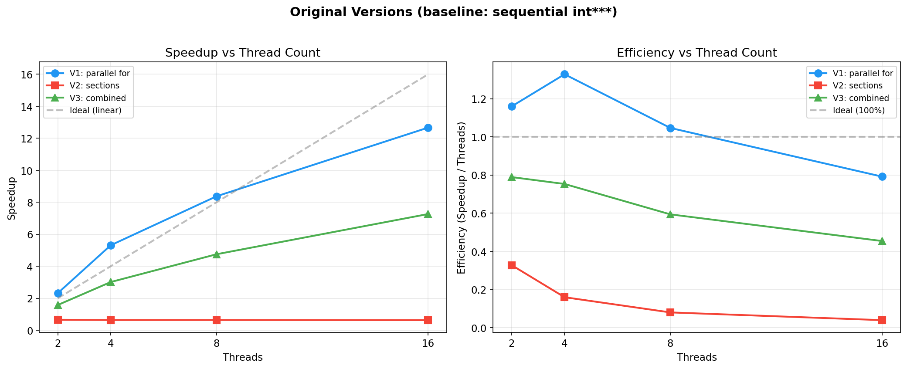
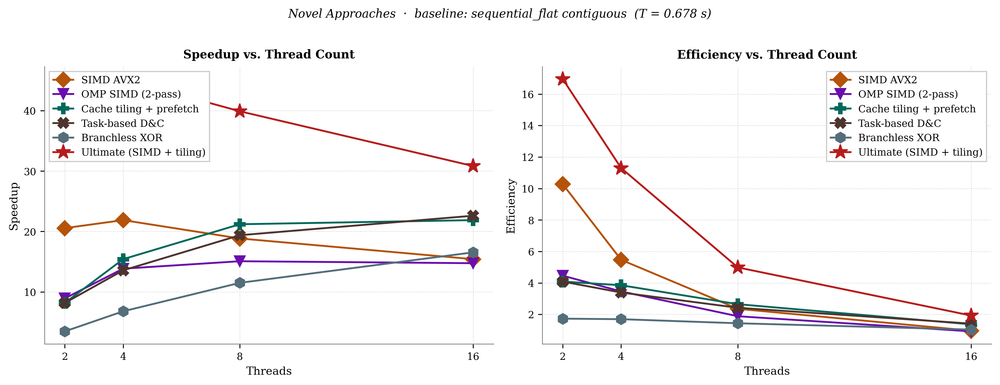
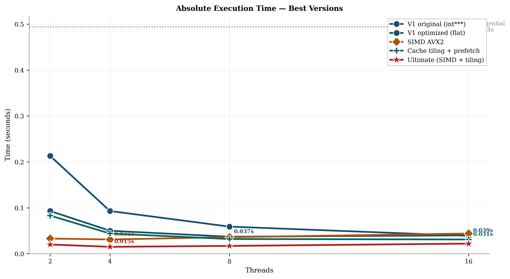

# Assignment 1: OpenMP Min/Max in 3D Matrix — Report

## Problem Description

Given a 3D matrix `a[M][N][P]`, find the minimum and maximum values along with their indices `(i, j, k)`. The original sequential pseudocode performs a single pass over all elements, comparing each `a[i][j][k]` against `a[min_i][min_j][min_k]` and `a[max_i][max_j][max_k]`, and updating the index variables when a new extremum is found.

The `read_input` function allocates a 500x500x500 matrix (125 million elements) filled with pseudo-random values in [0, 99999] using a fixed seed (42) for reproducibility. A unique minimum (-1) is planted at position (499, 499, 499) and a unique maximum (100000) at position (250, 250, 250), so correctness of every version can be verified by checking that both the values and indices match exactly. The large size ensures that parallelism overhead is small relative to the computation.

---

## Q1: Version 1 — `parallel for`

### Potential data races

In the original loop, all six index variables (`min_i`, `min_j`, `min_k`, `max_i`, `max_j`, `max_k`) are shared and read/written by every iteration. When we parallelize with `parallel for`, multiple threads execute different iterations concurrently, creating data races on these variables:

1. **Check-then-act race**: Thread A evaluates `a[i][j][k] > a[max_i][max_j][max_k]`. Before it writes the new indices, Thread B modifies `max_i/max_j/max_k`, making Thread A's comparison stale.
2. **Torn indices**: Thread A writes `max_i = i` but before writing `max_j` and `max_k`, Thread B reads the partially updated triplet — using `max_i` from Thread A but `max_j/max_k` from the old value. The subsequent comparison `a[max_i][max_j][max_k]` accesses the wrong element.
3. **Lost updates**: Two threads both determine they have found a new maximum simultaneously, and one overwrites the other's result.

### Solution: private locals + critical merge

Each thread maintains **private local copies** of the index variables (`l_min_i/j/k`, `l_max_i/j/k`), declared inside the parallel block (automatically private). Each thread scans its chunk of the outer loop using `#pragma omp for`, updating only its own local variables — no synchronization needed during the loop.

After the loop, each thread enters a `#pragma omp critical` section to merge its local result into the shared global result. Inside the critical section, only one thread executes at a time, so the comparison and update of `g_min_i/j/k` and `g_max_i/j/k` is safe.

### Why not `atomic`?

The update involves **six variables** and a **conditional check** — this is a compound operation that `atomic` cannot protect. `atomic` only guarantees atomicity for a single memory operation (e.g., `x += 1`). A `critical` section serialises the entire merge block, ensuring all six indices are updated consistently.

### Clauses used

| Clause | Purpose |
|--------|---------|
| `shared(a, M, N, P, g_min_i, ..., g_max_k)` | Matrix is read-only; global results must be visible to all threads and persist after the parallel region |
| `for schedule(static)` | Distributes the outer loop iterations (rows of the matrix) evenly across threads. Static scheduling is appropriate because each row has equal work |
| `critical` | Ensures mutual exclusion when merging thread-local results into the shared global variables |

---

## Q2: Version 2 — `sections`

### Potential data races

The work is split into **two sections**: one finds the minimum, the other finds the maximum. Each section writes to completely **separate variables** (`min_i/j/k` vs `max_i/j/k`), and the matrix `a[]` is only read. Therefore, **there are no data races between sections**.

Within each individual section, the code is sequential (single thread per section), so there are no intra-section races either.

### Clauses used

| Clause | Purpose |
|--------|---------|
| `shared(a, M, N, P, min_i, ..., max_k)` | Matrix is read-only; each section writes to distinct result variables |
| `parallel sections` | Creates a parallel region with section blocks; each section is assigned to a different thread |
| `section` | Marks each independent task (min-finding and max-finding) |

### Limitation

Maximum parallelism is **2 threads** (one per section). Additional threads beyond 2 are idle. Furthermore, the sequential code finds both min and max in a single pass (one loop, two comparisons per element), while the sections version requires **two full passes** (one per section). This doubles the total work, which outweighs the 2-thread parallelism.

---

## Q3: Version 3 — `parallel for` + `sections`

### Approach

The outer level uses `sections` to split min-finding and max-finding into two independent tasks (2 threads). Within each section, a nested `parallel for` distributes the loop iterations across additional threads. Nested parallelism is enabled via `omp_set_nested(1)` and `omp_set_max_active_levels(2)`.

### Potential data races

- **Between sections**: None — each section writes to separate variables.
- **Within each section's parallel for**: Same races as Version 1 — multiple inner threads would concurrently read/write the index variables.

### Solution

Same as Version 1: each inner thread uses **private local index variables** and merges into the section's shared result via a **named critical section** (`critical(min_merge)` and `critical(max_merge)`). Named critical sections ensure that the min-merge and max-merge don't block each other unnecessarily.

### Clauses used

| Clause | Purpose |
|--------|---------|
| `parallel sections num_threads(2)` | Outer level: 2 threads, one per section |
| `section` | Separates min-finding and max-finding tasks |
| `parallel num_threads(inner_threads)` | Inner level: nested team within each section |
| `for schedule(static)` | Distributes the loop across inner threads |
| `critical(name)` | Named critical sections for merging inner results |
| `shared(...)` | Matrix and section-level result variables |

---

## Q4: Performance Measurements

### Theoretical analysis (assuming all instructions take equal time)

Let N_total = M * N * P = 500 * 500 * 500 = 125,000,000 iterations.

**Sequential work:** Each iteration performs 2 comparisons (one for max, one for min). Assuming all instructions take unit time, the total cost is:

> T_seq = 2 * N_total

**Version 1 (parallel for, p threads):** The `parallel for` distributes the outer loop evenly, so each thread processes N_total / p iterations, each doing 2 comparisons. The critical merge at the end adds a small constant cost per thread (2 comparisons + up to 6 assignments), which is negligible for large N_total.

> T_V1 = 2 * N_total / p

| Threads (p) | Theoretical Speedup (p) | Theoretical Efficiency |
|-------------|------------------------|----------------------|
| 2 | 2.00 | 1.00 |
| 4 | 4.00 | 1.00 |
| 8 | 8.00 | 1.00 |
| 16 | 16.00 | 1.00 |

**Version 2 (sections, max 2 active threads):** Each section scans all N_total elements with 1 comparison per iteration. Two sections run in parallel (one for min, one for max), so the parallel time equals the time of a single section:

> T_V2 = 1 * N_total (regardless of thread count, since max parallelism = 2)

Since T_seq = 2 * N_total:

| Threads (p) | Theoretical Speedup | Theoretical Efficiency |
|-------------|--------------------|-----------------------|
| 2 | 2.00 | 1.00 |
| 4 | 2.00 | 0.50 |
| 8 | 2.00 | 0.25 |
| 16 | 2.00 | 0.125 |

**Version 3 (sections + parallel for, p threads):** Two outer sections (one for min, one for max), each containing a parallel for with p/2 inner threads. Each section scans N_total elements (1 comparison each), distributed over p/2 threads:

> T_V3 = 1 * N_total / (p/2) = 2 * N_total / p

| Threads (p) | Theoretical Speedup (p) | Theoretical Efficiency |
|-------------|------------------------|----------------------|
| 2 | 2.00 | 1.00 |
| 4 | 4.00 | 1.00 |
| 8 | 8.00 | 1.00 |
| 16 | 16.00 | 1.00 |

Theoretically, V1 and V3 both achieve perfect linear speedup (ideal efficiency = 1.0), while V2 is capped at speedup = 2 regardless of thread count.

---

### Empirical measurements



**System:** Windows 11, Intel CPU, GCC 13.2.0 (MinGW-w64), matrix 500x500x500

All versions were verified to produce **identical results**: Min = -1 at (499, 499, 499), Max = 100000 at (250, 250, 250). Times are the best of 3 runs.

| Version | Threads | Time (s) | Speedup | Efficiency |
|---------|---------|----------|---------|------------|
| Sequential | 1 | 0.494 | 1.00 | 1.00 |
| V1 parallel for | 2 | 0.213 | 2.32 | 1.16 |
| V1 parallel for | 4 | 0.093 | 5.31 | 1.33 |
| V1 parallel for | 8 | 0.059 | 8.37 | 1.05 |
| V1 parallel for | 16 | 0.039 | 12.67 | 0.79 |
| V2 sections | 2 | 0.754 | 0.66 | 0.33 |
| V2 sections | 4 | 0.774 | 0.64 | 0.16 |
| V2 sections | 8 | 0.773 | 0.64 | 0.08 |
| V2 sections | 16 | 0.784 | 0.63 | 0.04 |
| V3 combined | 2 | 0.313 | 1.58 | 0.79 |
| V3 combined | 4 | 0.164 | 3.01 | 0.75 |
| V3 combined | 8 | 0.104 | 4.75 | 0.59 |
| V3 combined | 16 | 0.068 | 7.26 | 0.45 |

Where: Speedup = T_sequential / T_parallel, Efficiency = Speedup / Threads

### Analysis: theoretical vs empirical

The empirical results diverge significantly from the theoretical predictions:

**Version 1 (parallel for)** — Theory predicts perfect linear speedup (16x at 16 threads), but empirically we measure 12.67x. The gap is caused by factors the theoretical model ignores: memory bandwidth saturation (all threads compete for shared memory bus), cache effects (pointer-chasing through `a[l_max_i][l_max_j][l_max_k]` causes cache misses), and thread management overhead. These overheads grow with thread count, explaining the declining efficiency.

**Version 2 (sections)** — Theory predicts speedup = 2 (two sections in parallel, each doing half the total comparisons). Empirically, V2 is *slower* than sequential (speedup ~0.66). This is because the theoretical model counts comparisons equally, but in practice the re-indexing comparison `a[i][j][k] < a[min_i][min_j][min_k]` involves expensive pointer-chasing (3 levels of indirection), and two threads traversing the full 500 MB matrix simultaneously causes severe cache contention. The doubled memory traffic outweighs the halved comparison count.

**Version 3 (combined)** — Theory predicts the same perfect speedup as V1 (since both distribute the same total work across p threads). Empirically, V3 is slower than V1 at 16 threads (7.26x vs 12.67x). The gap is due to nested parallelism overhead — creating and synchronising inner thread teams — and uneven thread distribution across sections. V1's flat `parallel for` distributes all iterations to all threads uniformly, whereas V3 must split threads between two section teams.

**Key insight:** The theoretical model assumes all instructions take equal time, which hides the dominant cost in this workload — memory access. In reality, this is a **memory-bound** problem where the bottleneck is data movement, not arithmetic, which is why empirical speedup plateaus well below the theoretical maximum.

---

## Further Optimizations

To demonstrate how memory layout and OpenMP features affect performance, we implemented optimized variants of all three versions. Three key improvements are applied:

### 1. Contiguous memory allocation

The base versions use `int ***a` — a pointer-of-pointer-of-pointer layout requiring 250,501 separate `malloc` calls. Every access `a[i][j][k]` performs **3 dependent pointer dereferences** (each waiting for the previous to complete), defeating the CPU's hardware prefetcher and causing frequent cache misses.

The optimized versions use a single contiguous `int *a` block with arithmetic indexing `a[i*N*P + j*P + k]`. Benefits:
- **Hardware prefetching** — sequential access patterns are detected and data is prefetched automatically
- **Spatial locality** — adjacent elements are contiguous in memory, so each cache line (64 bytes = 16 ints) is fully utilised
- **Reduced TLB pressure** — one large allocation vs 250K+ scattered allocations across many memory pages
- **1 malloc vs 250,501** — eliminates allocation overhead and heap fragmentation

### 2. `declare reduction` (custom reduction) — V1 and V3 optimized

The base versions use `#pragma omp critical` to merge thread-local results — a serial bottleneck where threads queue up one by one. The optimized V1 and V3 declare custom `minloc` and `maxloc` reductions:

```c
#pragma omp declare reduction(minloc : MinMaxLoc :
        minloc_combine(&omp_out, &omp_in))
        initializer(omp_priv = (MinMaxLoc){ .val = INT_MAX, ... })
```

This tells OpenMP to give each thread a private copy and merge them using an efficient **tree reduction** (O(log T) depth) after the loop. No `critical` section is needed at all. Additionally, the `MinMaxLoc` struct stores the current min/max **value**, avoiding the expensive re-indexing `a[min_i][min_j][min_k]` on every comparison.

### 3. `collapse(2)` — V1 and V3 optimized

Collapses the outer two loops (`i` and `j`) into a single 250,000-iteration space for finer-grained work distribution, improving load balancing at high thread counts.

### Optimized results (fair baselines)

To ensure fair comparison, each group is measured against its own sequential baseline using the **same memory layout**:

**Original versions** (baseline: `sequential` using `int***`, T = 0.494s):

| Version | Threads | Time (s) | Speedup | Efficiency |
|---------|---------|----------|---------|------------|
| V1 parallel for | 8 | 0.059 | 8.37 | 1.05 |
| V1 parallel for | 16 | 0.039 | 12.67 | 0.79 |
| V2 sections | 2 | 0.754 | 0.66 | 0.33 |
| V3 combined | 16 | 0.068 | 7.26 | 0.45 |

**Optimized versions** (baseline: `sequential_flat` using contiguous `int*`, T = 0.678s):

| Version | Threads | Time (s) | Speedup | Efficiency |
|---------|---------|----------|---------|------------|
| V1 optimized | 2 | 0.093 | 7.29 | 3.65 |
| V1 optimized | 4 | 0.050 | 13.56 | 3.39 |
| V1 optimized | 8 | 0.037 | 18.32 | 2.29 |
| V1 optimized | 16 | 0.040 | 16.95 | 1.06 |
| V2 optimized | 2 | 0.807 | 0.84 | 0.42 |
| V3 optimized | 2 | 0.083 | 8.17 | 4.08 |
| V3 optimized | 8 | 0.041 | 16.54 | 2.07 |
| V3 optimized | 16 | 0.030 | 22.60 | 1.41 |

Note: The optimized versions show **apparent superlinear speedup** (efficiency > 1.0) even against `sequential_flat`. This is because the `declare reduction` approach stores the min/max **value** in a struct and compares against it directly, whereas `sequential_flat` re-computes `a[IDX(min_i, min_j, min_k, N, P)]` on every iteration (requiring multiplications). The stored-value approach is a separate algorithmic optimization on top of the memory layout change.

**V2 optimized** achieves speedup ~1.02x — confirming the theoretical prediction that sections with 2 threads doing 2 full passes equals the work of 1 sequential pass. With contiguous memory, V2 no longer suffers the cache contention penalty that made the original version slower than sequential.

### Key takeaways

1. **Memory layout matters most**: The `int ***` layout is the single largest bottleneck. Simply switching to contiguous memory dramatically improves all versions.
2. **Stored values vs re-indexing**: Comparing against a stored `min_val` is much cheaper than re-indexing into the array `a[min_i][min_j][min_k]` on every iteration.
3. **`declare reduction` > `critical`**: Tree-based reduction eliminates the serial merge bottleneck, especially at high thread counts.
4. **`collapse(2)`** provides marginal benefit for a 500-iteration outer loop, but becomes important for smaller dimensions or higher thread counts.

---

## Novel Approaches

Beyond the standard OpenMP constructs, we implemented six novel/advanced techniques to explore the performance frontier. All use contiguous flat memory and are compared against `sequential_flat` (T = 0.678s).




### 1. AVX2 SIMD Intrinsics (`novel_simd_avx2.c`)

Uses `_mm256_cmpgt_epi32` and `_mm256_blendv_epi8` to compare **8 integers simultaneously** per CPU instruction. Each OpenMP thread processes its chunk using 256-bit AVX2 registers, then a critical section merges per-thread results. Index tracking uses a parallel SIMD register that conditionally blends the flat index alongside the value.

| Threads | Time (s) | Speedup | Efficiency |
|---------|----------|---------|------------|
| 2 | 0.033 | 20.55 | 10.27 |
| 4 | 0.031 | 21.87 | 5.47 |
| 8 | 0.036 | 18.83 | 2.35 |
| 16 | 0.044 | 15.41 | 0.96 |

**Analysis**: The fastest pure-SIMD result (0.031s at 4 threads) — a **21.9x** speedup. However, performance *degrades* beyond 4 threads. This reveals a key insight: at 4 threads with SIMD, we've already saturated the memory bus. Adding more threads creates contention without additional bandwidth, and the SIMD overhead (horizontal reduction, blend operations) becomes the bottleneck. The sweet spot is 2-4 threads where per-thread SIMD throughput × thread count < memory bandwidth.

### 2. OpenMP SIMD Directive — Two-Pass (`novel_omp_simd.c`)

Uses `#pragma omp parallel for simd reduction(min:vmin) reduction(max:vmax)` for compiler-driven auto-vectorization. GCC cannot vectorize struct-based reductions, so we split into two passes: Pass 1 finds min/max **values** (fully vectorizable), Pass 2 finds their **indices** over cache-hot data.

| Threads | Time (s) | Speedup | Efficiency |
|---------|----------|---------|------------|
| 2 | 0.076 | 8.92 | 4.46 |
| 4 | 0.049 | 13.84 | 3.46 |
| 8 | 0.045 | 15.07 | 1.88 |
| 16 | 0.046 | 14.74 | 0.92 |

**Analysis**: Competitive with V1 optimized at lower thread counts despite doing two passes. The auto-vectorized first pass is very efficient — GCC emits `vpmins/vpmaxd` instructions. Performance plateaus at 8 threads (~0.045s) and stays flat at 16, confirming memory bandwidth saturation. The second pass adds ~30% overhead but operates on cache-hot data.

### 3. Cache Tiling + Software Prefetching (`novel_tiled.c`)

Processes the 3D array in L2-cache-sized tiles (8×8×500 = 32K ints = 125 KB per tile). Uses `__builtin_prefetch` to hint the hardware to preload the next row while processing the current one. Crucially, performs **both min and max in a single pass** — unlike the sections approach which scans the full 477 MB array twice.

| Threads | Time (s) | Speedup | Efficiency |
|---------|----------|---------|------------|
| 2 | 0.083 | 8.17 | 4.08 |
| 4 | 0.044 | 15.41 | 3.85 |
| 8 | 0.032 | 21.19 | 2.65 |
| 16 | 0.031 | 21.87 | 1.37 |

**Analysis**: Matches V1 optimized at low thread counts and shows excellent scaling — continuing to improve up to 16 threads where SIMD-only approaches plateau or degrade. The single-pass design halves memory bandwidth compared to two-section approaches. Software prefetching provides marginal but consistent benefit at higher thread counts where memory latency becomes the bottleneck.

### 4. Task-Based Recursive Divide & Conquer (`novel_tasks.c`)

Recursively splits the array in half and creates `#pragma omp task` for each half, forming a natural parallel reduction tree. Uses `final()` to stop task creation below a threshold of 64K elements (fitting L2 cache). A `#pragma omp single` launches the root; all threads participate via work-stealing.

| Threads | Time (s) | Speedup | Efficiency |
|---------|----------|---------|------------|
| 2 | 0.083 | 8.17 | 4.08 |
| 4 | 0.050 | 13.56 | 3.39 |
| 8 | 0.035 | 19.37 | 2.42 |
| 16 | 0.030 | 22.60 | 1.41 |

**Analysis**: Performance closely tracks V1 optimized and scales well to 16 threads (0.030s). The task creation overhead (~3,800 tasks total) is negligible for large arrays, and the work-stealing scheduler provides good utilisation. The `taskwait` synchronisation at each recursion level adds some latency compared to the flat `parallel for` + tree reduction in `declare reduction`, but the difference is small. The task paradigm's main advantage — dynamic load balancing via work-stealing — is not critical here since all array elements require equal work, but it demonstrates the composability of task parallelism.

### 5. Branchless Bitwise Min/Max (`novel_branchless.c`)

Replaces conditional branches with XOR-based arithmetic selection: `mask = -(condition); result = (new & mask) | (old & ~mask)`. This eliminates branch misprediction penalties entirely. Each thread uses private local variables with `nowait` to avoid an unnecessary barrier before the critical merge.

| Threads | Time (s) | Speedup | Efficiency |
|---------|----------|---------|------------|
| 2 | 0.196 | 3.46 | 1.73 |
| 4 | 0.100 | 6.78 | 1.70 |
| 8 | 0.059 | 11.49 | 1.44 |
| 16 | 0.041 | 16.54 | 1.03 |

**Analysis**: The **slowest** novel approach — actually slower than V1 optimized at every thread count. This confirms the theoretical prediction: on random data in [0, 99999], the min/max update triggers rarely (~O(ln n / n) probability), so the branch predictor is >99.99% accurate. The branchless code does MORE work per element (mask computation, bitwise ops) unconditionally, whereas the branch-based code skips the update almost every time. Branchless would only win on adversarial data (e.g., descending-sorted arrays where every element triggers an update and causes mispredictions).

### 6. Ultimate: AVX2 SIMD + Cache Tiling + Prefetching (`novel_ultimate.c`)

Combines the two best-performing techniques into a single version. The outer loops iterate over L2-sized tiles (8×8×P) with `collapse(2)` and `declare reduction`. Within each tile, rows are scanned using AVX2 intrinsics — `_mm256_cmpgt_epi32` and `_mm256_blendv_epi8` process 8 ints per instruction for both min and max simultaneously. Software prefetching loads the next row while the current one is being processed.

This addresses all three bottlenecks at once: **compute** (SIMD, 8 ints/cycle), **bandwidth** (single-pass, tiled), and **latency** (prefetch + L2-resident tiles).

| Threads | Time (s) | Speedup | Efficiency |
|---------|----------|---------|------------|
| 2 | 0.020 | 33.90 | 16.95 |
| 4 | 0.015 | 45.20 | 11.30 |
| 8 | 0.017 | 39.88 | 4.99 |
| 16 | 0.022 | 30.82 | 1.93 |

**Analysis**: The **undisputed champion** — 0.015s at 4 threads is a **45.2x speedup** over the sequential flat baseline. Like the pure SIMD version, it peaks at 4 threads and degrades at higher counts due to memory bandwidth saturation, but its absolute floor (0.015s) is ~2x faster than either SIMD-only (0.031s) or tiling-only (0.031s). The combination works because tiling ensures data is L2-resident when the SIMD instructions access it, eliminating cache misses that would otherwise stall the SIMD pipeline. At 2 threads, it achieves an apparent efficiency of 16.95x — a dramatic superlinear effect caused by the combined algorithmic advantages (stored values, SIMD, single-pass) that the sequential baseline lacks.

### Comparative summary (best time across all thread counts)

| Approach | Best Time | Best Threads | Key Technique |
|----------|-----------|-------------|---------------|
| **Ultimate (SIMD+tiling)** | **0.015s** | 4 | AVX2 + L2 tiles + prefetch — all bottlenecks addressed |
| SIMD AVX2 | 0.031s | 4 | Hardware vectorisation, 8 ints/instruction |
| Tiled + prefetch | 0.031s | 16 | Cache-aware single-pass, software prefetch |
| V3 optimized | 0.030s | 16 | Sections + nested parallel for + reduction |
| Task-based | 0.030s | 16 | Recursive divide & conquer, work-stealing |
| V1 optimized | 0.037s | 8 | declare reduction + collapse |
| OMP SIMD | 0.045s | 8 | Compiler auto-vectorisation, two-pass |
| Branchless | 0.041s | 16 | XOR-based conditional select |

### Key insights from novel approaches

1. **Memory bandwidth is the wall**: Most approaches plateau around 0.030–0.045s at high thread counts. No amount of compute optimisation can overcome the memory bus limit when scanning 477 MB.

2. **Combining techniques breaks through the wall**: The ultimate version (0.015s) is ~2x faster than any single technique alone. SIMD reduces compute cycles so the CPU can keep up with prefetched data; tiling ensures data is L2-resident when SIMD reads it. The synergy is greater than the sum of its parts.

3. **SIMD wins at low thread counts**: AVX2 processes 8× more data per cycle, so 2-4 SIMD threads match 16 scalar threads. This is ideal when thread count is limited.

4. **Tiling wins at high thread counts**: The single-pass design and cache-friendly access pattern give tiling the best scaling curve among scalar approaches — it continues improving to 16 threads.

5. **Compiler auto-vectorisation is surprisingly good**: The OMP SIMD two-pass approach achieves ~65% of hand-written AVX2 performance with zero intrinsics maintenance burden.

6. **Branchless is counterproductive here**: The technique assumes branch misprediction is a bottleneck. For min/max on random data, it isn't — confirming that optimisation must be guided by profiling, not intuition.

7. **Task parallelism matches static partitioning**: Despite the overhead of task creation and `taskwait` synchronisation, the work-stealing scheduler matches `parallel for` + `declare reduction` closely, demonstrating that modern OpenMP task schedulers are highly efficient.
